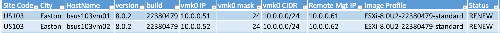

# VMware Host Inventory (PowerCLI)

Author: Bryan Smith  
Created: 2026-02-06  
Last Updated: 2026-10-02

## Revision History

| Date       | Author | Change Summary                                                        |
| ---------- | ------ | --------------------------------------------------------------------- |
| 2026-02-06 | Bryan  | Initial document                                                      |
| 2026-10-02 | Bryan  | Added sample output and field reference, trimmed lab platform section |

---

## Overview

[Get-InfutableVMWInventory.ps1](Get-InfutableVMWInventory.ps1) builds an Excel report of every ESXi host in vCenter, one row per host: ESXi version, management network, out-of-band management IP (iDRAC, iLO, etc.), warranty status, licensing, and site contact/address.

It is based on a script I wrote for a multi-site production environment with several hundred hosts. It started as a way to collect the out-of-band management IP for every host. Once it could walk the whole environment, teammates started asking for more data, and it became the base/engine for other reports and bulk changes.

**Sample output** (lab hosts, sample data, partial view):

**Status:** `REPLACE` = hardware is 7+ years old (from support start), `RENEW` = support ends this year or has already ended, `OK` = in support, `! Data` = serial found but support dates are missing, blank = serial not in the asset spreadsheet.

## Report Fields

| Category               | Fields                                                                                | Source                                                                                                                                                                |
| ---------------------- | ------------------------------------------------------------------------------------- | --------------------------------------------------------------------------------------------------------------------------------------------------------------------- |
| Host                   | HostName, version, build, Image Profile, Uptime (days)                                | vCenter (`Get-View HostSystem`)                                                                                                                                       |
| Network                | vmk0 IP, vmk0 mask (prefix length), vmk0 CIDR                                         | vCenter, CIDR calculated from IP and mask                                                                                                                             |
| Out-of-band management | Remote Mgt IP                                                                         | ESXCLI (`hardware ipmi bmc get`)                                                                                                                                      |
| Hardware and warranty  | Model, Serial, Support Start, Support End, Status                                     | Model and serial from vCenter, support dates matched by serial from a hardware asset spreadsheet, Status calculated                                                   |
| Licensing              | License Key, License Type                                                             | vCenter license manager                                                                                                                                               |
| Site                   | Site Code, City, State, Zip Code, Address, Country, Site Contact, Site Contact: Email | Site code parsed from the hostname (`bsus103vm01` = `US103`, see [naming](../README.md#naming-and-multi-site-design)), the rest matched by site code from a sites CSV |

## How It Works

1. `Get-View -ViewType HostSystem` pulls all hosts in one call with a property filter. Working with the vSphere API view objects directly is much faster than `Get-VMHost` in large environments and exposes more data.
2. The script loops through each host, adds the report fields to the host object, and fills them from vCenter, ESXCLI, and the two input files.
3. Results are sorted by hostname and exported with `Export-Excel` as a styled table with filters, on a worksheet named after the vCenter.

## Inputs

| File | Matched on | Provides |
|------|------------|----------|
| `Input\sites.csv` | `Site Code` | Contact Name, Contact Email Address, Address, City, State, Zip Code, Country |
| `Input\LabHardware.xlsx` (worksheet `Assets`) | `Serial Number` | Support Start, Support End |

Paths are set at the top of the script. Either file could be replaced by a database or vendor warranty API.

## Prerequisites

- PowerCLI and ImportExcel modules
- An active `Connect-VIServer` session to the target vCenter

## Other Uses

- Push the same host objects to a CMDB or NetBox instead of Excel
- Tag hosts in vCenter with site and warranty data so alerts include it
- Bulk configuration changes using the same loop

## Lab Platform

My lab moved from vSphere to XCP-ng and Proxmox when my evaluation licenses expired after the Broadcom acquisition. This script is kept as a reference and is not actively maintained.

## Future Improvements

- Split the section blocks (`Get-LicenseInfo`, `Get-HostCidrAndNetMask`, etc.) into functions
- Run the license query once before the host loop (it returns every host's assignment), keep the per-host match inside the loop
- Parameters for the input and output paths

## References

### Internal
- [Naming and multi-site design](../README.md#naming-and-multi-site-design)

### External
- [ImportExcel module](https://github.com/dfinke/ImportExcel)
- [VMware PowerCLI](https://developer.broadcom.com/powercli)
