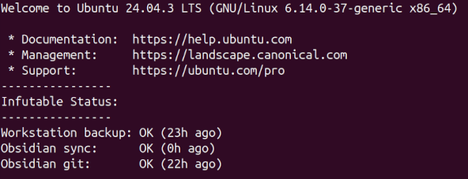

Author:  Bryan Smith  
Date:  02/04/2026  

## Document Revision History

| Date       | Author | Change Summary                          |
|------------|--------|------------------------------------------|
| 2026-02-15 | Bryan  | Added Step 5: Nemo + SSHFS |

# Workstation Setup

> Laptop client configuration for integration with the jump station. See the [parent README](../README.md) for architecture overview.

## NOTES:
* This workflow is designed for a personal lab environment to demonstrate architecture patterns, operational discipline, and automation techniques.

* In a production environment, this design would be adapted to include centralized identity management, managed secrets, formal monitoring and alerting, immutable backups, and change-control processes. The core patterns remain the same; the controls and tooling would differ.

* The notes are detailed to provide a map for future automation.
---
### Prerequisites
* Base laptop setup is already complete (See [base-setup.md](base-setup.md))
* Hostnames are **lowercase**

---

## Step 1 — Workstation Foundations

### Objectives\notes
- Passwordless SSH access
- Stable VS Code Remote-SSH workflow
- Clear separation of identities and responsibilities
- SSH keys are **per laptop** (no more shared “one laptop” identity).
- Backups are **hostname-based destinations** : `<hostname>_backup`.

### Host Identity (Laptop)

Set hostname **before** creating keys:

```bash
sudo hostnamectl set-hostname <hostname>
hostnamectl
```

### SSH Configuration (Laptop → Jump Station as `bryan`)

**Key created (no passphrase):**
```
~/.ssh/infutable_jump_<hostname>_ed25519
```

Generate:
```bash
ssh-keygen -t ed25519 -f ~/.ssh/infutable_jump_<hostname>_ed25519 -N "" -C "infutable-jump:<hostname>"
```

**SSH config entry (laptop):**
```
Host infutable-jump
    HostName bsus103jump02
    User bryan
    IdentityFile ~/.ssh/infutable_jump_<hostname>_ed25519
    IdentitiesOnly yes
    PreferredAuthentications publickey
```

Verify:
```bash
ssh infutable-jump
```

### VS Code (Laptop)

Extension required:
- **Remote – SSH**

Workflow:
- Connect to host alias `infutable-jump`
- Workspace stored remotely on jump station
- Open folder on jump station (example):
  ```
  /srv/repos/infutable-infra
  ```

**Result:** Opening VS Code connects to jump station, ready to work.

---

## Step 2 — Laptop to Jump Station Backup Pipeline (Hostname-based)

### Design Principles
- Push-based backups (laptop initiates)
- Least-privilege service account
- Deterministic permissions
- Human-readable status signal
- No policy baked into backup scripts

---

### Service Account (Jump Station)

**Account:** `ltubbackup`  
**Group:** `backups` (members: `bryan`, `ltubbackup`)

Create (one-time):
```bash
sudo useradd -m -s /bin/bash ltubbackup
sudo groupadd backups
sudo usermod -aG backups bryan
sudo usermod -aG backups ltubbackup
```

Create log directory (writable by ltubbackup):
```bash
mkdir -p /home/bryan/log/rsync
sudo chown ltubbackup:backups /home/bryan/log/rsync
sudo chmod 2770 /home/bryan/log/rsync
```

---

### Backup Directories (Jump Station) — Per Laptop

Destinations are hostname-based:

```
/home/bryan/Documents/<hostname>_backup
/home/bryan/Pictures/<hostname>_backup
/home/bryan/Desktop/<hostname>_backup
```

Create (one-time per laptop):
```bash
sudo mkdir -p /home/bryan/Documents/<hostname>_backup
sudo mkdir -p /home/bryan/Pictures/<hostname>_backup
sudo mkdir -p /home/bryan/Desktop/<hostname>_backup

sudo chown ltubbackup:backups /home/bryan/Documents/<hostname>_backup
sudo chown ltubbackup:backups /home/bryan/Pictures/<hostname>_backup
sudo chown ltubbackup:backups /home/bryan/Desktop/<hostname>_backup

sudo chmod 2770 /home/bryan/Documents/<hostname>_backup
sudo chmod 2770 /home/bryan/Pictures/<hostname>_backup
sudo chmod 2770 /home/bryan/Desktop/<hostname>_backup
```

---

### SSH Key for Backups (Laptop → ltubbackup)

**Key (per laptop):**
```
~/.ssh/ltubbackup_<hostname>_ed25519
```

Generate on the laptop:
```bash
ssh-keygen -t ed25519 -f ~/.ssh/ltubbackup_<hostname>_ed25519 -N "" -C "ltubbackup:<hostname>"
```

**Add the key to jump station (`ltubbackup`)**

If `ssh-copy-id` fails with `Permission denied (publickey)`, add it manually from an account that can SSH to the jump station:

1) On the laptop:
```bash
cat ~/.ssh/ltubbackup_<hostname>_ed25519.pub
```

2) On the jump station (as bryan):
```bash
sudo -u ltubbackup mkdir -p ~ltubbackup/.ssh
sudo -u ltubbackup touch ~ltubbackup/.ssh/authorized_keys
sudo chmod 700 ~ltubbackup/.ssh
sudo chmod 600 ~ltubbackup/.ssh/authorized_keys
sudo -u ltubbackup bash -c 'cat >> ~ltubbackup/.ssh/authorized_keys'
```
Paste the public key line, press Enter, then Ctrl-D.

Verify from laptop:
```bash
ssh -i ~/.ssh/ltubbackup_<hostname>_ed25519 -o IdentitiesOnly=yes ltubbackup@bsus103jump02 'echo OK'
```

---

### Backup Script (Laptop)

**Location:** `~/bin/ltub-backup.sh`  
See: `ltub-backup.sh` in this repo.

**Behavior:**
- Writes FAIL status before starting
- Backs up Documents, Pictures, Desktop
- Marks OK only after all backups complete
- Logs locally to `~/log/rsync/`
- Writes status remotely to jump station per-host file

**Remote status file (Jump Station):**
```
/home/bryan/log/rsync/<hostname>-backup-status.txt
```

**Format:**
```
<ISO-8601 timestamp> <OK|FAIL>
```

---

### Cron Scheduling (Laptop)

```bash
crontab -e
```

```cron
0 12 * * * /home/bryan/bin/ltub-backup.sh
```

---

## Step 3 — Obsidian Vault Sync + Health Signal

### Objectives
- Keep Obsidian fast and local on the laptop
- Maintain a continuously updated copy on the jump station
- Avoid Git credentials or Git metadata on the laptop
- Provide a simple, inspectable sync health signal

---

### Vault Layout

**Laptop (Syncthing path):**
```
/srv/syncthing/obsidian/vault
```

**Jump Station (inside Git repo):**
```
/srv/repos/obsidian/vault
```

Only the `vault/` directory is synchronized.

---

### Syncthing Configuration (Steady-state)

- Folder Type: **Send & Receive**
- File Versioning: **Simple File Versioning**
  - Keep Versions: 3
  - Clean out after: 1 day
  - Cleanup interval: 3600 seconds

Syncthing is used strictly for **live transport**, not backups.

---

### Safe Onboarding for a New Laptop

1) **Jump station**
- Edit the existing Obsidian folder in the Syncthing console
- Share it with the new laptop device

2) **Laptop**
- Accept the shared folder
- Set local path:
  ```
  /srv/syncthing/obsidian/vault
  ```
- Set folder type to **Receive Only** initially

3) Allow full sync to complete (file counts match, no warnings)

4) Flip laptop folder to **Send & Receive**

---

### Sync Heartbeat Mechanism

A lightweight heartbeat file confirms laptop participation:

**File:**
```
vault/.syncstamp
```

**Writer:** Laptop cron writes ISO-8601 timestamp only  
**Reader:** Jump station login status script evaluates freshness (24-hour threshold)

---

### Laptop Heartbeat Script

**Location:** `~/bin/obsidian-syncstamp.sh`  
See: `obsidian-syncstamp.sh` in this repo.

Crontab entry:
```cron
*/30 * * * * /home/bryan/bin/obsidian-syncstamp.sh
```

---

## Step 4 — Obsidian Git Snapshots (Jump Station)

(Git runs only on the jump station, status file is consumed by the login banner)

Status file:
```
~/log/obsidian-git/obsidian-git-status.txt
```

Crontab entry (example):
```cron
0 13 * * * /home/bryan/bin/obsidian-git-snapshot.sh
```

---

## Login Status Banner (Jump Station)

Ubuntu dynamic MOTD script:
```
/etc/update-motd.d/50-infutable-status
```

THis should display on login to the jump station:



---
---

## Step 5 — Nemo + SSHFS Mount

### notes
- Replace Nautilus with Nemo
- Mount jump station `/srv` via SSHFS to workstation

---

### Install Required Packages (workstation)
```bash
sudo apt update
sudo apt install -y nemo sshfs
```

---

### Set Nemo as Default File Manager
```bash
xdg-mime default nemo.desktop inode/directory application/x-gnome-saved-search
nautilus -q
nemo &
```

---

### Create Local Mount Namespace
```bash
mkdir -p ~/mnt/bsus103jump02/srv
chmod 700 ~/mnt
```

---

### Mount Jump Station `/srv` via SSHFS
SSH identity and hostname are defined via `~/.ssh/config` (Host: `infutable-jump`).

```bash
sshfs infutable-jump:/srv ~/mnt/bsus103jump02/srv \
  -o reconnect,ServerAliveInterval=15,ServerAliveCountMax=3 \
  -o StrictHostKeyChecking=accept-new \
  -o cache=no
```

---