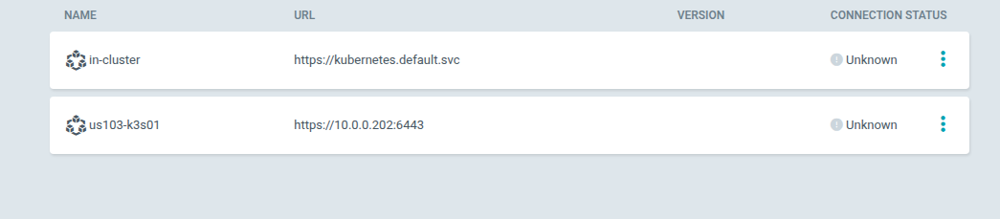
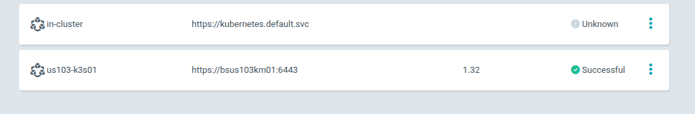

# 08-19-2025

## Inbox
Argocd
	- Add in k3s cluster, see notes for url to add.
		○ Test solar system
	- Figure out organization of projects with repo
	- Finish redeploy
	- Get it to fit within that file structure, if any struggle, leave in legacy.

## Notes

---
k get secrets -n argocd argocd-initial-admin-secret -o json | jq .data.password -r | base64 -d

-4Hl0k2tIWSbwMlO
---
# ArgoCD login

```bash
argocd cluster add context-name

argocd login 10.0.2.22:30137 --username admin --password passwordhere --insecure

argocd cluster add  us103-k3s01
```


WARNING: This will create a service account `argocd-manager` on the cluster referenced by context `us103-k3s01` with full cluster level privileges. Do you want to continue [y/N]? y
{"level":"info","msg":"ServiceAccount \"argocd-manager\" already exists in namespace \"kube-system\"","time":"2025-08-19T15:33:38-04:00"}
{"level":"info","msg":"ClusterRole \"argocd-manager-role\" updated","time":"2025-08-19T15:33:38-04:00"}
{"level":"info","msg":"ClusterRoleBinding \"argocd-manager-role-binding\" updated","time":"2025-08-19T15:33:38-04:00"}
Cluster 'https://10.0.0.202:6443' added



```bash
argocd cluster rm us103-k3s01
```

Fixed IP, added hostname in kubectl config

```bash
argocd cluster add  us103-k3s01
```



added wildcard dns entries *.us103kubeadm01.infutable.com and *.us103k3s01.infutable.com for future app deployments.

p@ssw0rd1

---
#  ArgoCD package troubleshooting
```bash
kubectl -n argocd patch configmap argocd-cmd-params-cm --type merge \
  -p '{"data":{"server.insecure":"true"}}'

kubectl -n argocd patch configmap argocd-cm --type merge \
  -p '{"data":{"url":"https://argocd.infutable.com","ui.theme":"dark"}}'

kubectl -n argocd rollout restart deploy/argocd-server
```

