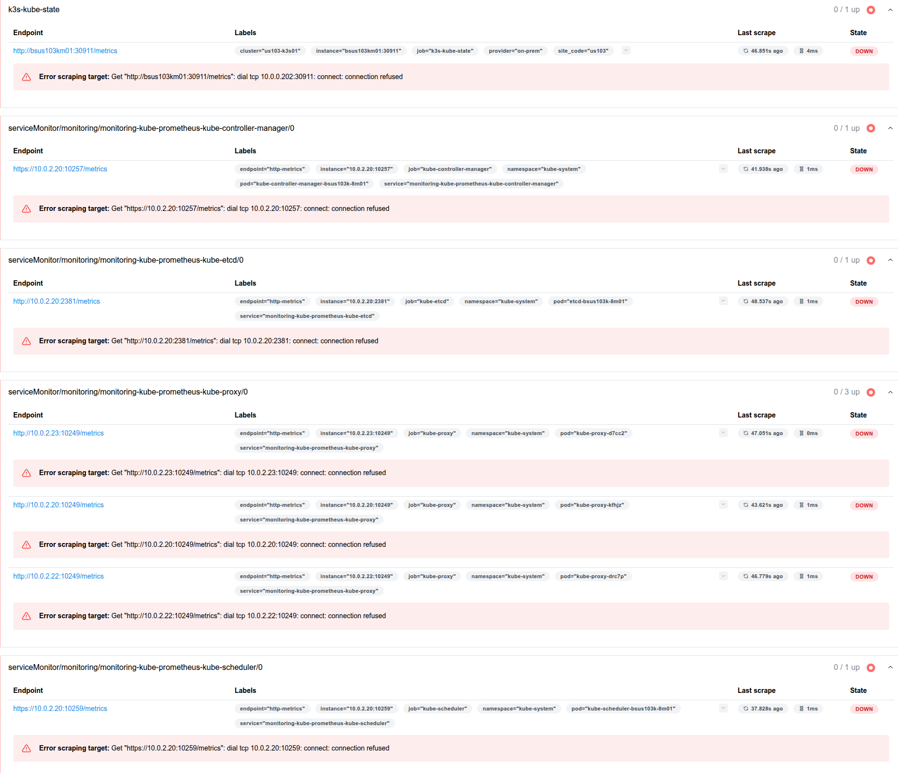

# 08-26-2025


## Inbox

## Notes

### Documentation:  questions and add
remove grafana/prom - do i need to remove the PVC before the namespace?  Add this to the documentation also (note:  k is an alias for kubectl, so replace the alias please)

```bash
helm uninstall -n monitoring monitoring
k delete pvc -n monitoring --all
k delete namespaces monitoring

```

to make changes:
```bash
helm upgrade monitoring prometheus-community/kube-prometheus-stack -n monitoring -f prometheus-values.yaml
```

Check logs:
```bash
kubectl logs -n monitoring deployment/monitoring-grafana | grep -i dashboard
```
---
 troubleshoot prometheus\grafana dashboards showing NA:
 ```bash
kubectl -n monitoring port-forward svc/monitoring-kube-prometheus-prometheus 9090
# then open http://localhost:9090/targets
```



On my external cluster running node-exporter (k3s - node http://bsus103km01:30911 in screenshot above), this is the result:

─[bryan@bsus103jump01:{us103-k3s01}]─[/srv/repos/infutable-infra/k8s]
└──╼ $k get pods -n monitoring | grep kube-state
kube-state-metrics-7c64d947d4-888jh            0/1     Pending   0          46h
-  I uncordoned this node and it is running now.  down status is resolved in screenshot above for node http://bsus103km01:30911.  


─[bryan@bsus103jump01:{us103-kubeadm01}]─[/srv/repos/infutable-infra/k8s]
└──╼ $k get pods -n monitoring | grep kube-state
monitoring-kube-state-metrics-69dcd947d6-qfw7j           1/1     Running   1 (7h7m ago)   21h

-  this is running, so I do not know why the local cluster prom/grafana is showing down still (see above screenshot).  

This is the node-exporter-full dashboard.  I have this nice representation in the screenshot of CPU, memory, disk, etc.  It only shows the one host though - the external cluster.  

How do I have these same visualizations (widgets, whatever) for the nodes in the cluster it is on?  under "hosts" I do not see the hosts for the cluster it is on (makes sense since this is the "node-exporter" dashboard, but I am sure we can get these same visuals on the local cluster nodes too?)

I pasted the json for the entire dashboard, but I just want the part at the top that I screenshotted for now on a new dashboard - but I want the same visualizations for other nodes (specifically named bsus103.  I would like a new dashboard with ONLY those widgets/panels (visualizations, whatever) about CPU/ram/swap/root fs used, etc (and the other things in that screenshot too).  
So, I want a dashboard to have only these metrics, but for all the hosts and not just bsus103km01 (again noting that this is the node-exporter dashboard, and I assume the local cluster it is on isn't using node-exporter?)

The other (local) nodes are:
bsus103k-8m01	
bsus103k-8w01	
bsus103k-8w02