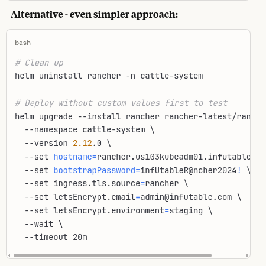

# 08-27-2025

## Inbox

## Notes

### Need to deal with:
bootstrap password in there?  
labels/naming conventions - see notes on monitoring
cluster:us103kubeadm01 (not kubeadm01)
Do I want it just to be rancher.infutable.com, grafana.infutable.com, etc?  And when do I want to do something like infutable.com/apps instead?  I think the infracomponents should be their own hostname I guess, so argocd and rancher and grafana should not be a subdirectroy (or whatever it is called) of infutable?   Only the small little apps?

Left off here:

