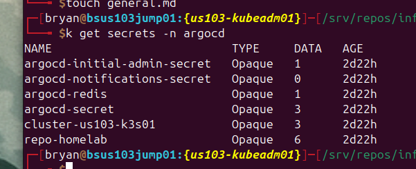
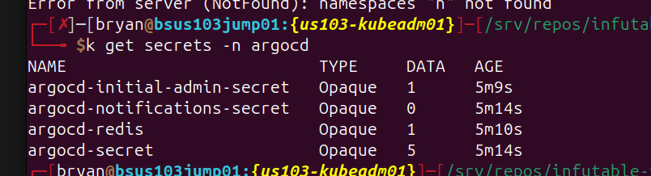
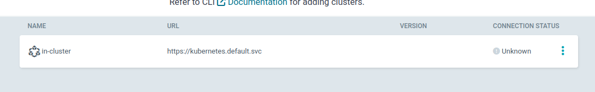

# 2025-08-18

## goals
Argocd
	- Step by step.  This worked once, maybe, or the secret was already there.  Try to test it with existing deployment - adding the secret.  
	- SEE CREATE GITHUB CHAT UNDER ARGO IN CHAT>  Create a new secret maybe, figure out a way to store locally, may need to remove other secrets.
	- Try to get k3s imported as well.
	- Get it to fit within that file structure. 

## Notes
---
current:

after vanilla deployment:

-  same result for cluster:
	-  

---

repo URL:
https://github.com/1BSmithITGuy/infutable-infra

https://github.com/1BSmithITGuy/infutable-infra.git

---

---

# Add to Documentation:
git@github.com:1BSmithITGuy/infutable-infra.git
---

https://argo-cd.readthedocs.io/en/stable/operator-manual/cluster-management/#adding-a-cluster

