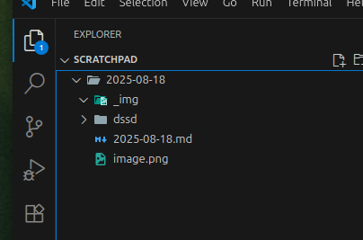

# 2025-08-18

## Previous day

what did this mean exactly in the notes above?
Bind a key (e.g., Ctrl+Alt+V) to the command Paste Image in VS Code’s Keyboard Shortcuts.

Quick reminders:

Make sure the file is saved (your daily-note launcher already does that).

Workspace settings (this file) override user settings, which is what you want for a scratchpad-only setup.

Workflow (what you want)

Open your daily note (your hotkey that creates YYYY-MM-DD.md already does this).

Hit Ctrl+K, V to Open Preview to the Side. Leave it pinned there.

Copy screenshot (Flameshot → clipboard).

Press Ctrl+Alt+V (your Paste Image binding).
The image is saved to _img/ next to the note and a line like
 is inserted.

The right-hand preview updates instantly, showing the image with your notes.

Notes & gotchas

You won’t see images inline in the raw editor; Markdown preview is the renderer.

Make sure the note is a real file (saved) so the extension knows where to put _img/—your launcher already handles this.

If you commit this folder anywhere, add _img/ to .gitignore unless you want screenshots in Git.

If you want the preview to pop automatically whenever you open a .md, I can give you a tiny “auto-open preview” setting or an extension that does it on file open.
## Notes

### Scratchpad:

new:
sh -c 'root="/srv/repos/infutable-infra/users/Bryan/scratchpad"; day="$(date +%F)"; dir="$root/$day"; file="$dir/$day.md"; mkdir -p "$dir/_img"; [ -f "$file" ] || printf "# %s\n\n## Inbox\n\n## Notes\n\n" "$day" > "$file"; code --new-window "$root"; sleep 0.3; code -r -g "$file"'

old:
sh -c 'd="$HOME/scratchpad"; f="$d/$(date +%F).md"; mkdir -p "$d"; [ -f "$f" ] || printf "# %s\n\n## Inbox\n\n## Notes\n\n" "$(date +%F)" > "$f"; code --new-window "$d"; sleep 0.3; code -r -g "$f"'

sh -c 'root="/srv/repos/infutable-infra/users/Bryan/scratchpad"; day="$(date +%F)"; dir="$root/$day"; file="$dir/$day.md"; mkdir -p "$dir/_img"; [ -f "$file" ] || printf "# %s\n\n## Inbox\n\n## Notes\n\n" "$day" > "$file"; code --new-window "$root"; sleep 0.3; code -r -g "$file"'
